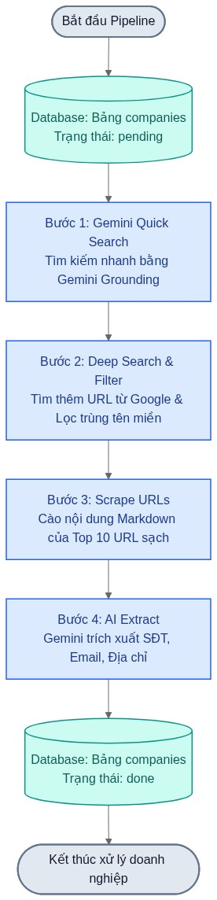
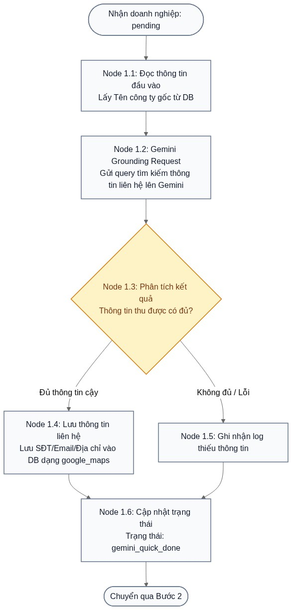
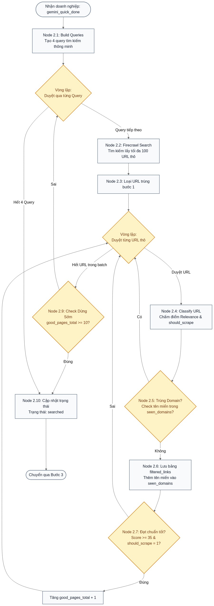
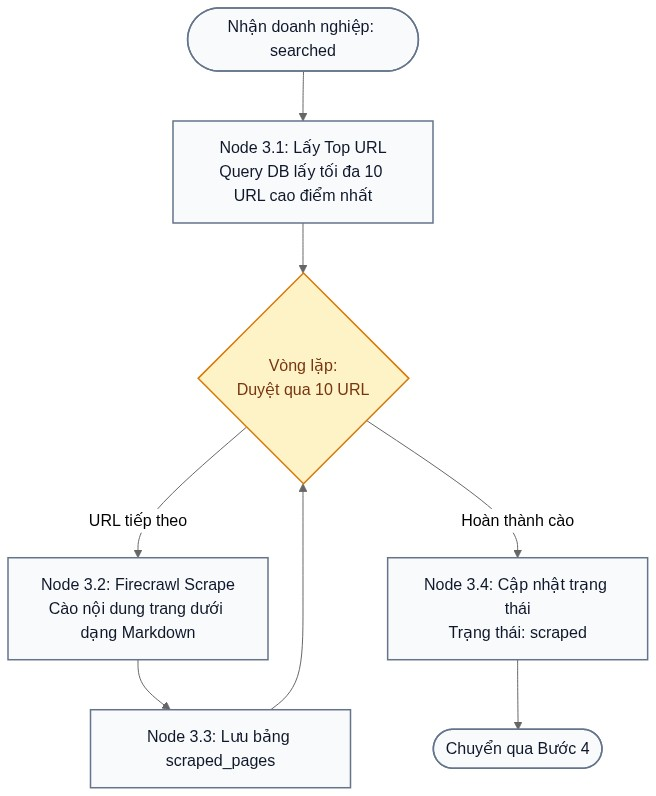
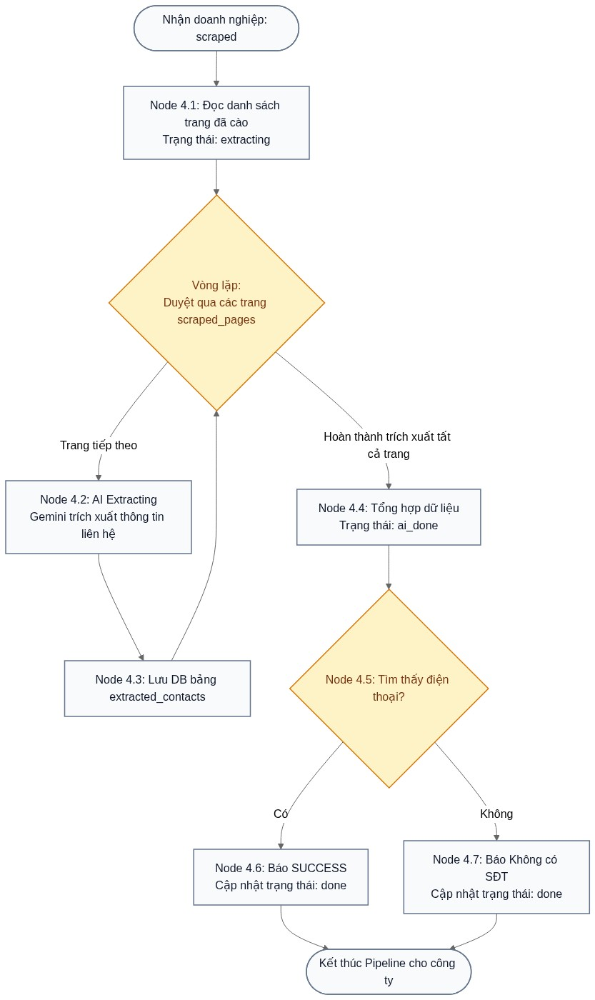

# Báo Cáo: Sơ đồ Node Luồng Hoạt động Full Pipeline (4 Bước)

Tài liệu này trình bày toàn bộ luồng hoạt động của hệ thống tự động tìm kiếm và trích xuất thông tin doanh nghiệp Việt Nam dưới dạng sơ đồ các Node chức năng (tương tự như công cụ tự động hóa n8n).

---

## 1. Tổng Quan Luồng Hoạt động (High-Level Pipeline)

Hệ thống chạy qua **4 bước tuần tự** để xử lý một doanh nghiệp:

---

## 2. Chi Tiết Từng Bước (Detailed Step-by-Step Nodes)

---

### BƯỚC 1: GEMINI QUICK SEARCH (Tìm kiếm nhanh)
*Mục đích: Tìm kiếm nhanh số điện thoại và thông tin cơ bản qua tính năng Google Search Grounding của Gemini trước để thu được dữ liệu có độ tin cậy cao.*

* **Node 1.1:** Đọc thông tin đầu vào (Tên gốc của doanh nghiệp).
* **Node 1.2:** Gửi request kèm Grounding tìm kiếm trực tiếp qua Gemini API.
* **Node 1.3:** Đánh giá tính đầy đủ của dữ liệu. Nếu đủ thông tin, lưu thẳng thông tin liên hệ vào cơ sở dữ liệu và đánh dấu trạng thái hoàn thành.

---

### BƯỚC 2: DEEP SEARCH & FILTER (Tìm kiếm sâu & Lọc)
*Mục đích: Gọi nhiều query tìm kiếm chi tiết để thu thập các liên kết liên quan nhất, chấm điểm và lọc sạch trùng domain để chuẩn bị danh sách cào.*

* **Node 2.1 & 2.2:** Xây dựng tối đa 4 query thông minh và tìm kiếm bằng Firecrawl.
* **Node 2.3 & 2.4:** Loại bỏ URL trùng lắp với Bước 1, chấm điểm độ tin cậy của các link mới.
* **Node 2.5 & 2.6:** Thực hiện loại trùng tên miền (Deduplicate Domain) - mỗi domain chỉ giữ lại duy nhất 1 liên kết điểm cao nhất.
* **Node 2.9:** Kích hoạt ngắt sớm (Early Stop Search) khi tích lũy đủ 10 link chất lượng tốt để tiết kiệm credit tìm kiếm.

---

### BƯỚC 3: SCRAPE URLs (Cào dữ liệu thô)
*Mục đích: Lấy nội dung văn bản (Markdown) sạch từ các trang web chất lượng nhất đã được lọc ở Bước 2 để chuẩn bị dữ liệu cho AI.*

* **Node 3.1 & 3.2:** Lấy Top 10 URL tốt nhất thu được từ Bước 2 và thực hiện cào nội dung Markdown sạch bằng Firecrawl Scrape.
* **Node 3.3 & 3.4:** Lưu toàn bộ kết quả thành công vào bảng `scraped_pages`.

---

### BƯỚC 4: AI EXTRACT (Trích xuất thông tin liên hệ bằng AI)
*Mục đích: Dùng Gemini đọc nội dung Markdown của tất cả các trang đã cào để trích xuất số điện thoại, địa chỉ, email và tổng hợp dữ liệu doanh nghiệp.*

* **Node 4.2 & 4.3:** Lần lượt đưa nội dung Markdown của từng trang đã cào cho Gemini trích xuất thông tin.
* **Node 4.4 & 4.5:** Tổng hợp thông tin từ tất cả các trang và cập nhật trạng thái kết quả cuối cùng cho doanh nghiệp.
